<h1 align="center">CryptoQuest - Play.Win.Earn</h1>

<p align="center">
  <a href="/">
    
  </a>
  <h6>Built at Ready Player 3 Hackathon by Thirdweb</h6>
  </p>

  <p>Play CryptoQuest game online at <a href="https://gateway.ipfscdn.io/ipfs/QmWG464ZH4iM4juDU59qFgeUxj3YYp5Hjn6ZCdk9iDnMLG">here</a></p>
  <p>Visit CryptoQuest store at <a href="https://thirdweb.com/goerli/0x9d8b644b5F56cA24e916872e97816Da329662Bbf/listings">here</a></p>
  
  <p align="center"><a href="https://www.youtube.com/watch?v=TPbk4xOZLSo">Watch Demo Video on YouTube</a></p>

## Features

CryptoQuest is a fun and exciting Play To Earn game that combines the nostalgia of classic 8-bit role-playing games with modern, streamlined gameplay. With our game, players have the opportunity to earn and own what they play for, as all game data is securely stored on the Goerli Blockchain. We aim to provide a sense of accomplishment and ownership to all of our players by immersing them in a world of adventure, where they can collect treasure, defeat monsters, and unlock unique NFT rewards.

Built with Thirdweb and powered by the Goerli Blockchain, CryptoQuest offers a unique and rewarding gaming experience that is sure to captivate and engage players of all levels."

🎮 Secure authentication with Coinbase / Metamask wallet.

🎮 In Game Store for Buying weapons.

🎮 $CQT (CryptoQuest game token) Token Rewards.

🎮 Thirdweb Game storefront for buying game weapons and using them as game assets as NFT. Every character is Rare and has unique abilities.\*\*

🎮 Deployed on IPFS powered by Thirdweb.

🎮 CryptoQuest DAO to reward game-artists assets through on chain voting using $CQT token.

## Technologies Used

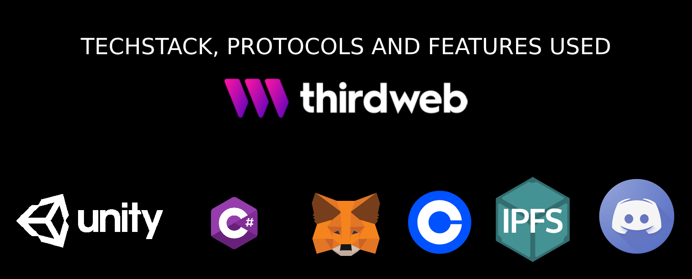

**Unity Editor** is used to build the game, engine and logic.

**Metamask Wallet**: For secure authentication with the Goerli Blockchain.

**[Thirdweb Gamingkit](https://portal.thirdweb.com/gamingkit)**: For wallet connection and communicating with contracts on chain.

**[Thirdweb Token Drop Contract](https://thirdweb.com/goerli/0x5798380179F1A837Bd26b511D08b8F6652159bbe/)**: for creating token ($CQT game token and NFT tokens).

**[Thirdweb Marketplace Contract](https://thirdweb.com/goerli/0x9d8b644b5F56cA24e916872e97816Da329662Bbf/listings)**: For creating and utilizing an in-game marketplace.

**[Thirdweb Edition Contract](https://thirdweb.com/goerli/0x259D578e95ef73F6A5e1cdF5F7DD59188Db03Ed5/nfts)**: For releasing many NFTs based on the same asset.

**[OpenZeppelin Gasless Relayers](https://defender.openzeppelin.com/)**: For making transactions on the chain gasless.

**[Thirdweb Cli](https://portal.thirdweb.com/cli)**: For deploying game to IPF.

## Quick Start

For development unity version 2021.3.17f1 is required.

- [Unity](https://unity.com/download) v2021.3.17f1 is required.

## Create your custom token drop using Thirdweb Token Drop Contract.

The Token Drop contract is a way of releasing your ERC20 tokens for a set price. It allows you to define the conditions for when and how your users can claim your tokens; including allowlists, release dates, and claim limits.

- [Token Drop](https://thirdweb.com/thirdweb.eth/DropERC20).
- [View Contract](https://thirdweb.com/goerli/0x5798380179F1A837Bd26b511D08b8F6652159bbe)

## Create your custom Edition for use in marketplace.

The Edition contract is best used when you want to release many NFTs based on the same asset, but you don't want to "drop" or "release" them for your community to claim.

- [Edition](https://thirdweb.com/goerli/0x259D578e95ef73F6A5e1cdF5F7DD59188Db03Ed5/nfts)
- [View Contract](https://thirdweb.com/goerli/0x259D578e95ef73F6A5e1cdF5F7DD59188Db03Ed5)

## Create your custom marketplace for selling assets to be used in game.

The Edition contract is best used when you want to release many NFTs based on the same asset, but you don't want to "drop" or "release" them for your community to claim.

- [Edition](https://thirdweb.com/thirdweb.eth/TokenERC1155)
- [View Contract](https://thirdweb.com/goerli/0x9d8b644b5F56cA24e916872e97816Da329662Bbf)

## Running the program locally

```
Open the game in Unity Editor
```

### Gameplay

<p align="center">

<a href="/">
    
  </a>

  <a href="/">
    
  </a>
  <a href="/">
    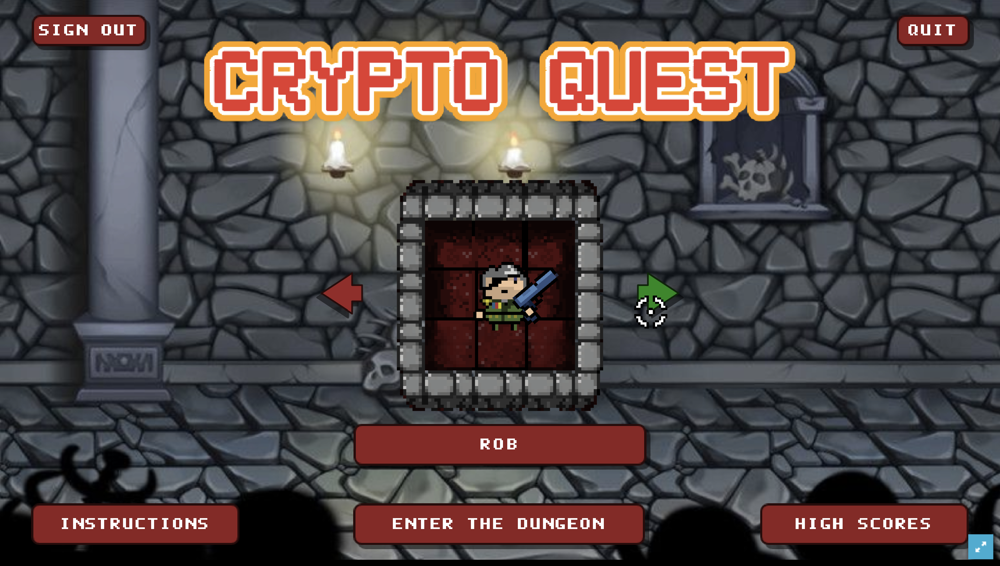
  </a>
  <a href="/">
    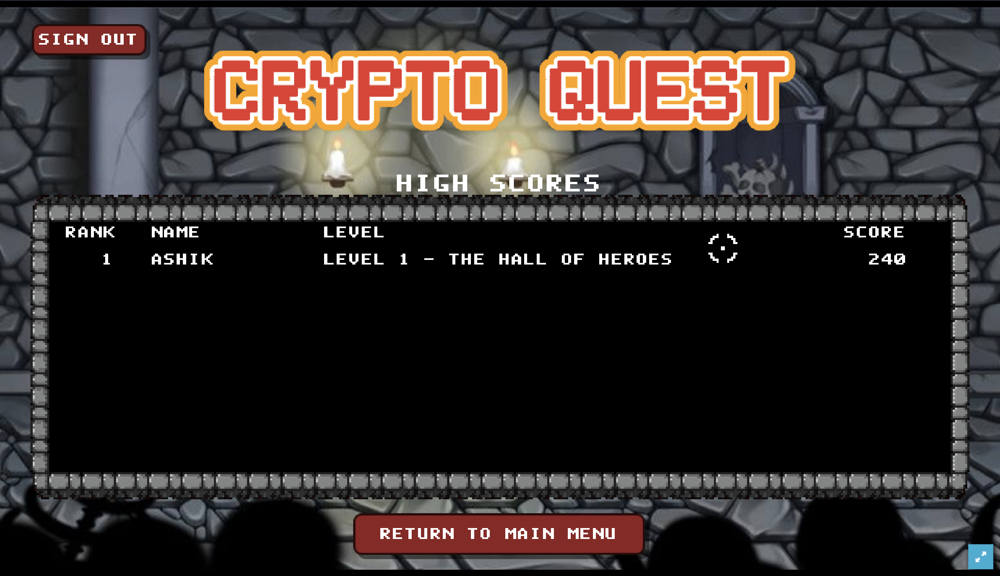
  </a>
  <a href="/">
    
  </a>
  <a href="/">
    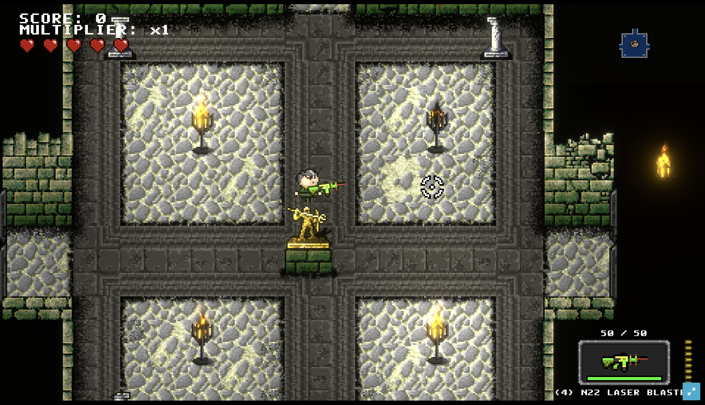
  </a>
  <a href="/">
    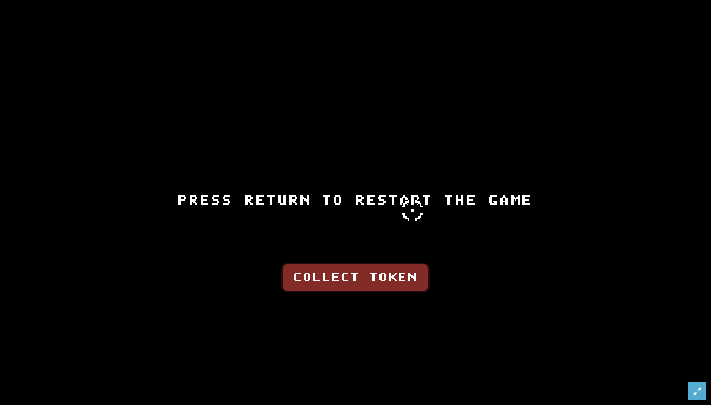
  </a>
  <a href="/">
    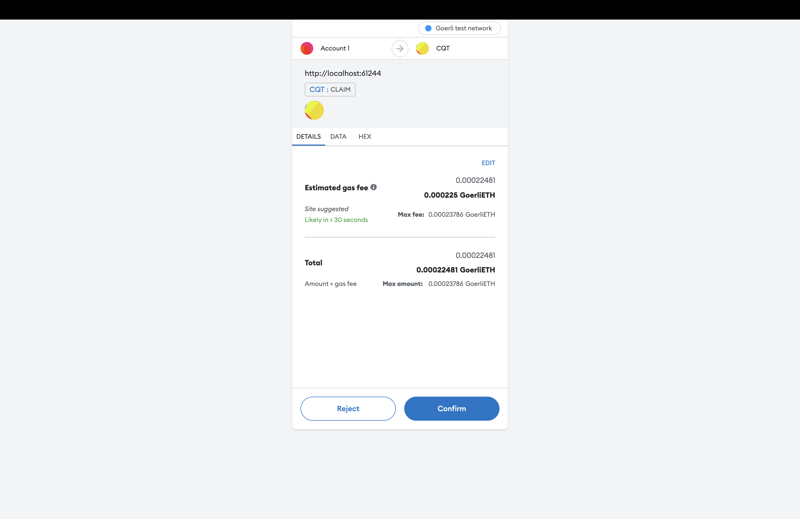
  </a>
  <a href="/">
    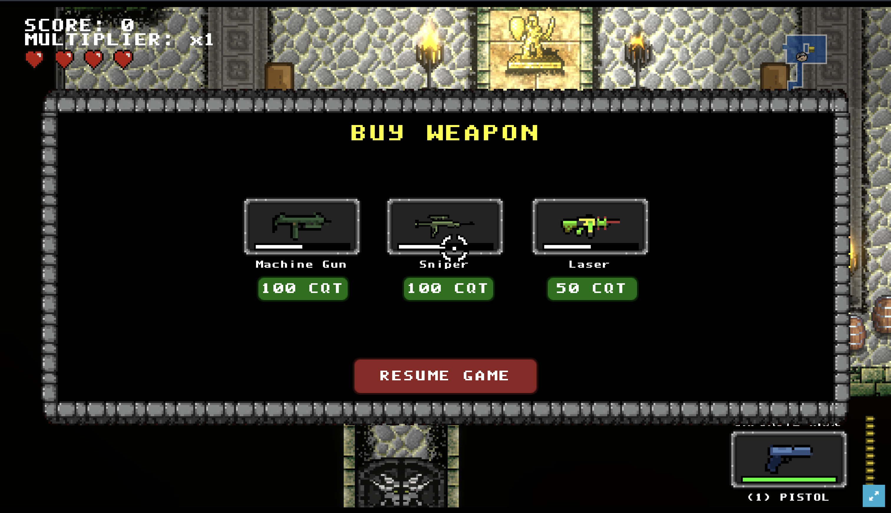
  </a>
  <a href="/">
    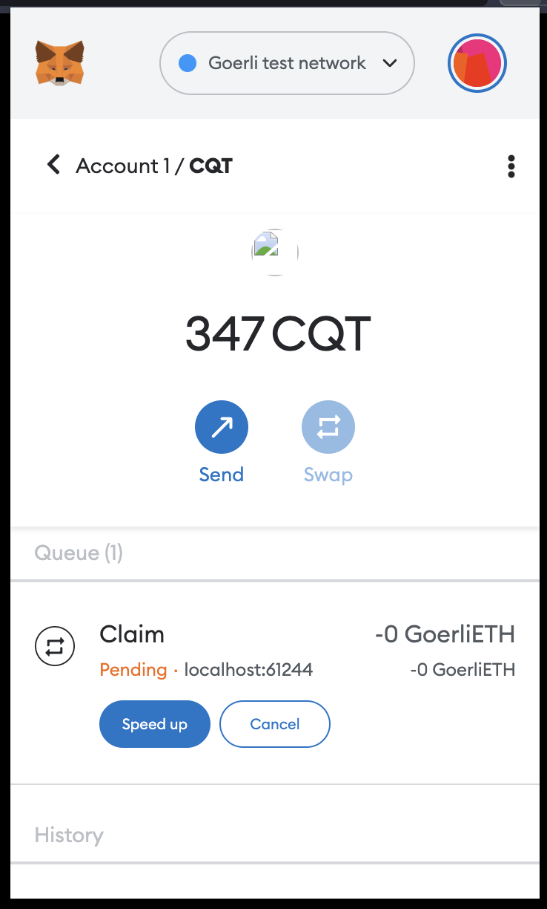
  </a>
  <a href="/">
    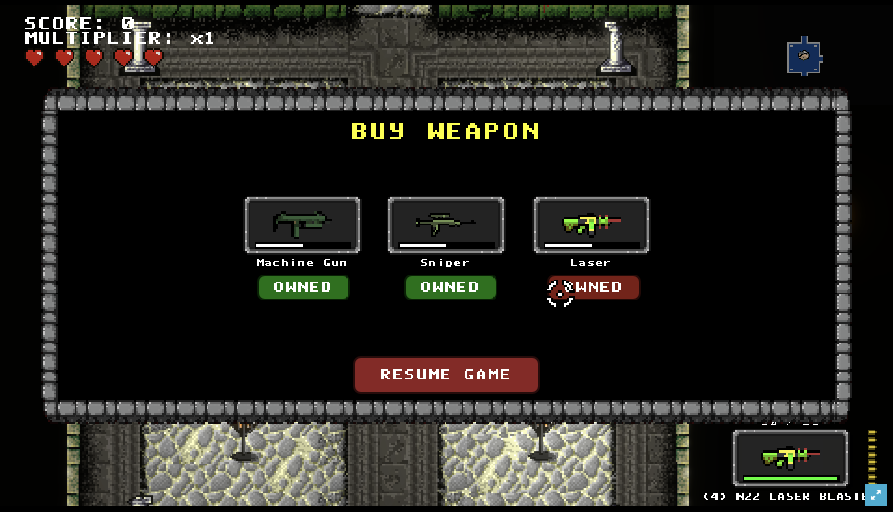
  </a>
  <a href="/">
    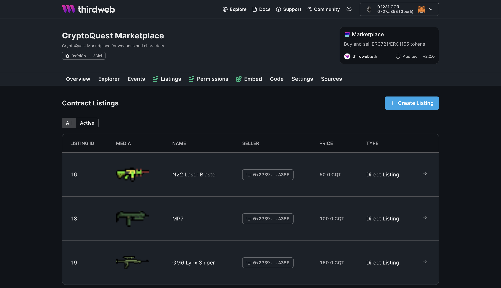
  </a>
  <a href="/">
    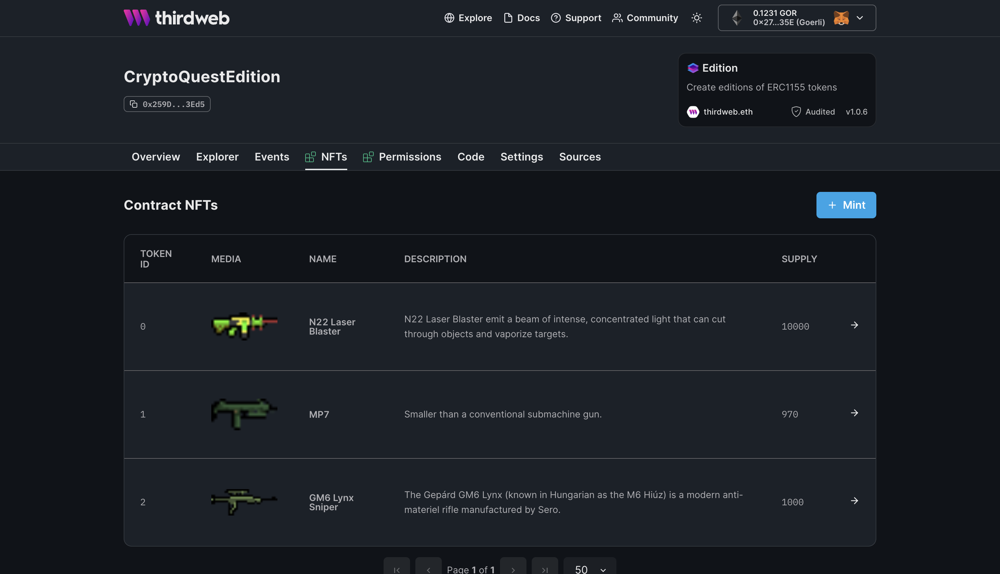
  </a>
  </p>
